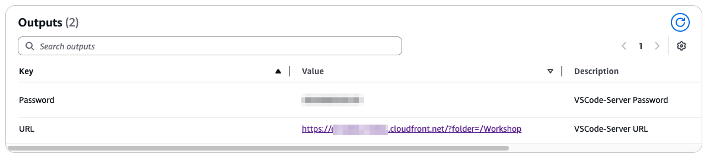

# Workshop Prerequisites

Before starting Lab 1, please complete the following setup steps to ensure you have all the necessary resources and access for the workshop.

## 1. Access Your AWS Account

Click on the link shown in the image below to access your AWS account for this workshop:


## 2. Enable Bedrock Model Access for Claude Sonnet 3.7

For this workshop, you'll need to enable access to the Claude Sonnet 3.7 model in Amazon Bedrock:

1. Navigate to the [Amazon Bedrock console](https://console.aws.amazon.com/bedrock/home) in your AWS account
2. In the left navigation pane, under **Bedrock configurations**, choose **Model access**
3. On the Model access page, click the **Modify model access** button as shown below:


4. Find and select the Claude 3.7 Sonnet model from Anthropic:


5. Click **Next**
6. Review the access changes and read the Terms
7. Click **Submit** to request access to the model
8. Wait for the access status to change to **Access granted**

> Note: Model access changes may take a few seconds to be reflected in the console, make sure to refresh.

## 3. Access Your VSCode Environment

To access the VSCode environment for this workshop:

1. Navigate to the AWS CloudFormation console in your AWS account
2. Find and select the stack named **ec2vscode-stack**
3. Go to the **Outputs** tab to find the access information:



4. Note the following values:
   - **URL**: The web address to access your VSCode environment (e.g., https://d15zlktv1fa9ju.cloudfront.net/?folder=/Workshop)
   - **Password**: The password required to log in to the VSCode environment

5. Open the URL in your browser and enter the password when prompted to access your VSCode environment

## 4. Clone and Deploy the Workshop Repository

Once you're in the VSCode environment, follow these steps to set up the workshop code:

1. Open a terminal in VSCode (Terminal > New Terminal)
2. Clone the workshop repository:
   ```bash
   git clone https://github.com/johanneslanger/async-agents-workshop
   ```
3. Navigate to the root directory of the cloned repository:
   ```bash
   cd async-agents-workshop
   ```
4. Deploy the necessary resources for the workshop:
   ```bash
   make deploy
   ```
   This will set up all the required AWS resources for the workshop.

## Next Steps

Once you've completed all the prerequisites above, you're ready to start with Lab 1! Open the `labs/lab_1/lab_1_notebook.ipynb` file in your VSCode environment to begin.
