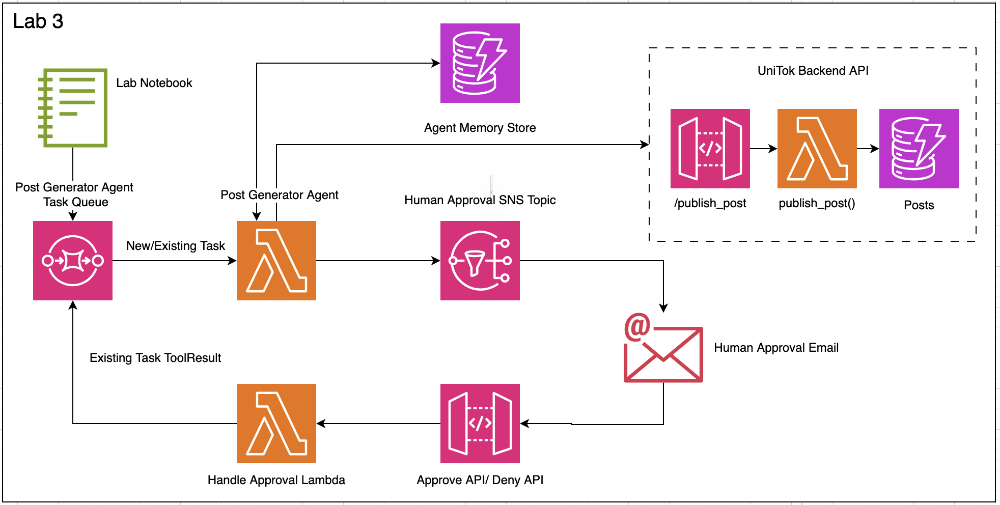

# Implementing Long-Running Tools

## Introduction

In Lab 3, we'll enhance our asynchronous agent architecture to handle long-running operations - specifically, a human approval workflow. This represents a critical pattern for real-world AI applications where certain decisions require human oversight before proceeding. We'll implement this pattern using a combination of state persistence, notifications, and asynchronous callbacks.

## Lab Objectives

By the end of this lab, you will:
- Understand how to implement long-running tools in asynchronous agents
- Configure state persistence using DynamoDB
- Set up human-in-the-loop approval workflows
- Implement a complete asynchronous flow with state management
- Test the agent's ability to pause, wait for external input, and resume execution

## The Challenge of Long-Running Operations

Many real-world agent tasks require operations that:
- Take longer than function timeout limits
- Need human input or approval
- Must wait for external systems to complete processing
- Should maintain their state across multiple executions

Our solution to this challenge involves:
1. **Persisting agent state** in DynamoDB
2. **Notifying humans** via SNS when approval is needed
3. **Capturing responses** through an API Gateway
4. **Resuming execution** by placing results back in the agent's queue

## Architecture Components

Our enhanced architecture adds these components:

1. **DynamoDB Table (`agent-memory-store`)**:
   - Stores agent conversation state and context
   - Enables the agent to "remember" where it left off
   - Indexed by session_id and agent_name

2. **SNS Topic (`approval-notifications`)**:
   - Sends email notifications requesting human approval
   - Contains links to approve or deny the generated content

3. **API Gateway (`approval-api`)**:
   - Provides endpoints for humans to submit approvals/denials
   - Captures approval decisions and forwards them to a handler

4. **Approval Handler Lambda**:
   - Processes approval decisions from the API Gateway
   - Places the tool result back in the agent's SQS queue

## Task Structure Evolution

Our SQS messages now have two distinct formats:

### New Task Format
```json
{
    "type": "new",
    "body": {
        "task": "new task description"
    }
}
```

### Existing Task Format (Tool Result)
```json
{
    "session_id": "id of the session",
    "type": "existing",
    "toolName": "name of the tool",
    "body": [{
        "toolResult": {
            "toolUseId": "id of the tool that was used",
            "status": "success|error",
            "content": [{"text": "tool result content | error message"}]
        }
    }]
}
```

## DynamoDB Schema

Our agent state is stored in DynamoDB with this structure:
```json
{
    "session_id": "id of the session created",  // primary key
    "agent_name": "name of the agent that has this session",  // sort key
    "messages": [{}, {}]  // list of messages in the conversation
}
```


## Advanced Tool Implementation

In this lab, we'll implement tools differently to support the asynchronous workflow. Unlike the simple tool definition in Lab 1, our long-running tools need to:

1. Track the `toolUseId` to match results when execution resumes
2. Signal the agent to pause execution and save state
3. Integrate with external notification systems

### Simple Tool (Previous Approach)
```python
from strands import tool

@tool
def publish_post(
    content: str, 
    author: str = "Unicorn Rentals", 
    unicorn_color: str = "rainbow", 
    image_url: str = None) -> str:
    """
    Publish a post to the UniTok social media platform.
    
    Args:
        content (str): The text content of the post.
        author (str, optional): The author of the post. Defaults to "Unicorn Rentals".
        unicorn_color (str, optional): The color of the unicorn. Choose from: pink, blue, purple, green, yellow, or rainbow. Defaults to "rainbow".
        image_url (str, optional): URL to an image to include with the post. Defaults to None.
        
    Returns:
        str: A message indicating the post was published successfully, or an error message.
    """
    # Implementation of the tool
```

### Long-Running Tool (New Approach)
```python
TOOL_SPEC = {
    "name": "human_approval",
    "description": "Request approval from a human for the content generated or critical decisions.",
    "inputSchema": {
        "json": {
            "type": "object",
            "properties": {
                "content": {
                    "type": "string",
                    "description": "Content or decision that needs to be approved by the human."
                }
            },
            "required": ["content"]
        }
    }
}

def human_approval(tool: ToolUse, **kwargs: Any) -> ToolResult:
    tool_use_id = tool["toolUseId"]
    content = tool["input"]["content"]
    request_state = kwargs.get("request_state", {})
    session_id = request_state.get('session_id', kwargs.get("session_id", None))

    logger.debug(f"Session ID: {session_id}")

    # Send out an SNS notification to request human feedback with content
    status = send_approval_email(content, session_id, tool_use_id)

    # Set the stop flag, so that the agent can sleep and store it's state in memory.
    request_state["stop_event_loop"] = True
    request_state["session_id"] = session_id

    return {
        "toolUseId": tool_use_id,
        "status": "success",
        "content": [{"text": status['message']}]
    }
```

This new approach provides several critical capabilities:
- **Tool Use ID Tracking**: Captures the `toolUseId` to match results when execution resumes
- **State Management**: Sets the `stop_event_loop` flag to signal the agent to pause execution
- **Session Persistence**: Maintains the `session_id` for state retrieval when execution resumes

Strands Agents SDK is capable of handling different forms of tool implementations and each carry it's own pros and cons. 

## Agent Workflow

Let's walk through the complete workflow:

1. **Task Initiation**:
   - A new marketing task arrives in the `post-generator-task-queue`
   - The Lambda function is triggered and initializes the agent

2. **Agent Processing**:
   - The agent generates a social media post based on the prompt
   - The agent determines if human approval is needed

3. **Human Approval Request**:
   - The agent calls the `human_approval` tool
   - The tool sets `stop_event_loop = True` to pause execution
   - The tool sends a notification via SNS
   - The agent's state is saved to DynamoDB
   - The Lambda function completes execution

4. **Human Interaction**:
   - A human receives an email with the proposed post
   - The email contains links to approve or deny
   - The human clicks one of the links, triggering the API Gateway

5. **Approval Processing**:
   - The approval handler Lambda processes the decision
   - It formats the result as an "existing task" message
   - It places this message in the `post-generator-task-queue`

6. **Agent Resumption**:
   - The agent Lambda is triggered by the new message
   - It loads the previous state from DynamoDB
   - It processes the approval result
   - If approved, it publishes the post to UniTok
   - The task completes

## Implementation Details

### Agent Modifications

We'll update our agent code to:
1. Save and load state from DynamoDB
2. Handle both new and existing tasks
3. Implement the `human_approval` tool
4. Process tool results when resuming execution


## Getting Started

To begin this lab:

1. Open the `lab_3_notebook.ipynb` file in your environment
2. Follow the step-by-step instructions to implement the long-running tool pattern
3. Deploy the additional AWS resources (DynamoDB, SNS, API Gateway, Lambda handler)
4. Test the complete workflow with sample marketing requests

## Key Takeaways

This lab demonstrates a powerful pattern for asynchronous agents:
- The ability to pause execution and wait for external input
- Persisting state across multiple invocations
- Implementing human-in-the-loop workflows
- Handling complex, multi-step processes asynchronously

This pattern can be extended to many other long-running operations beyond human approval, such as:
- Waiting for batch processing jobs to complete
- Handling scheduled operations
- Coordinating multi-step workflows with external systems

By mastering this pattern, you'll be able to build agents that can handle complex, real-world tasks that extend beyond the limitations of synchronous execution.
