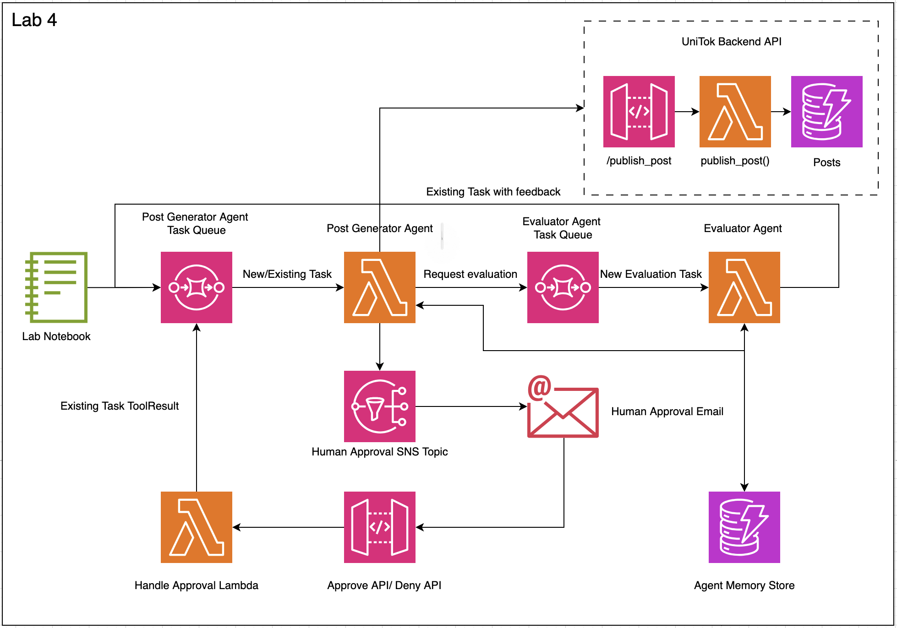

# Building Multi-Agent Systems with Asynchronous Communication

## Introduction

In Lab 4, we'll extend our asynchronous architecture to support multiple specialized agents working together. We'll implement a multi-agent pattern where our post generator agent collaborates with an evaluator agent to ensure content meets brand guidelines. This pattern demonstrates how complex tasks can be broken down and distributed across specialized agents, creating more robust and scalable AI systems.

## Lab Objectives

By the end of this lab, you will:
- Understand the multi-agent pattern for asynchronous systems
- Implement inter-agent communication via SQS
- Create specialized agents with distinct responsibilities
- Configure parent-child relationships between agents
- Test a complete multi-agent workflow

## Why Multi-Agent Systems?

Single-agent architectures face limitations when tasks require diverse expertise or complex workflows:
- One agent must be configured for all possible tasks
- Complex instructions can lead to confusion or errors
- Difficult to maintain separation of concerns
- Limited specialization reduces performance on domain-specific tasks

Multi-agent systems address these challenges by:
- Distributing tasks to specialized agents
- Enabling clear separation of responsibilities
- Allowing independent scaling of different agent types
- Supporting complex workflows through agent collaboration

## Architecture Components

Our multi-agent architecture adds these components:

1. **Evaluator Agent SQS Queue (`evaluator-agent-task-queue`)**:
   - Receives evaluation tasks from the post generator agent
   - Manages the queue of content to be evaluated

2. **Evaluator Agent Lambda Function**:
   - Contains the specialized evaluator agent code
   - Processes evaluation tasks from its SQS queue
   - Returns results to the requesting agent

3. **Inter-Agent Communication Tools**:
   - Tools that allow agents to request services from other agents
   - Handle the routing of tasks and results between agents

## Enhanced Task Structure

To support multi-agent communication, we've enhanced our task structure to include parent information:

```json
{
    "type": "new",
    "body": {
        "task": "new task description"
    },
    "parent": {
        "agent_name": "name of the agent who requested this task",
        "session_id": "id of the session that the parent is carrying",
        "callback_sqs": "SQS queue url to report the completion of the task",
        "tool_use_id": "id of the tool that was initiated to call this agent"
    }
}
```

This structure enables:
- **Task Routing**: Directing tasks to the appropriate agent
- **Result Callback**: Returning results to the requesting agent
- **Session Continuity**: Maintaining context across agent boundaries
- **Tool Use Tracking**: Connecting results back to the original tool call

## Agent Specialization
We will be integrating "Agents as Tools" which means we will have a tool local to the agent allowing it to put a task for another agent and a separate implementation of the agent taking that task and coming up with results.

### Post Generator Agent

The post generator agent focuses on creating engaging social media content and now includes a new tool to request evaluations:

```python
TOOL_SPEC = {
    "name": "evaluator-agent",
    "description": "Request evaluation of content against brand guidelines from the evaluator agent.",
    "inputSchema": {
        "json": {
            "type": "object",
            "properties": {
                "content": {
                    "type": "string",
                    "description": "Content that needs to be evaluated."
                }
            },
            "required": ["content"]
        }
    }
}

def evaluator_agent(tool: ToolUse, **kwargs: Any) -> ToolResult:
    tool_use_id = tool["toolUseId"]
    content = tool["input"]["content"]
    request_state = kwargs.get("request_state", {})
    session_id = request_state.get('session_id', kwargs.get("session_id", None))
    
    # Create a task for the evaluator agent
    task = {
        'type': 'new',
        'body': {
            'task': f"Evaluate this social media post: {content}",
        },
        'parent': {
            'agent_name': 'post_generator',
            'session_id': session_id,
            'callback_sqs': POST_GENERATOR_QUEUE_URL,
            'tool_use_id': tool_use_id
        }
    }
    
    # Send the task to the evaluator agent's queue
    send_message_to_sqs(EVALUATOR_QUEUE_URL, task)
    
    # Signal the agent to pause execution
    request_state["stop_event_loop"] = True
    request_state["session_id"] = session_id
    
    return {
        "toolUseId": tool_use_id,
        "status": "success",
        "content": [{"text": "Evaluation request sent. Waiting for results."}]
    }
```

### Evaluator Agent

The evaluator agent specializes in assessing content against brand guidelines. It can have the following instructions:

```
You are a specialized content evaluator for Unicorn Rentals, a company that offers unicorns for rent that kids and grown-ups can play with.

Your task is to evaluate social media posts for UniTok, our unicorn-themed social media platform, and ensure they adhere to our brand guidelines.

Brand Guidelines for Unicorn Rentals:
1. Content must be family-friendly and positive
2. Posts should highlight the magical experience of spending time with unicorns
3. When mentioning our new color selection feature, it should be accurate (colors: pink, blue, purple, green, yellow, and rainbow)
4. Our brand voice is magical, playful, and family-friendly
5. Posts should be between 50-200 characters for optimal engagement
6. Emojis should be used sparingly but effectively
7. Content should appeal to our target audience: families with children, fantasy enthusiasts, and event planners

For each post you evaluate:
1. Check if it adheres to ALL brand guidelines
2. Provide a clear APPROVED or REJECTED decision
3. If rejected, provide specific feedback on what needs to be improved
4. If approved, provide a brief explanation of why it meets our guidelines

Your evaluation should be thorough but concise.
Once evaluation is complete, publish your evaluations.
```

The `evaluator-agent` also has a tool `publish_evaluations` allowing it to create a task for parent to wakeup and take `toolResult`. It can be implemented like this:

```python
TOOL_SPEC = {
    "name": "publish_evaluation",
    "description": "Publish the evaluation results back to the requesting agent.",
    "inputSchema": {
        "json": {
            "type": "object",
            "properties": {
                "decision": {
                    "type": "string",
                    "description": "APPROVED or REJECTED decision."
                },
                "feedback": {
                    "type": "string",
                    "description": "Explanation or feedback about the evaluation."
                }
            },
            "required": ["decision", "feedback"]
        }
    }
}

def publish_evaluation(tool: ToolUse, **kwargs: Any) -> ToolResult:
    tool_use_id = tool["toolUseId"]
    decision = tool["input"]["decision"]
    feedback = tool["input"]["feedback"]
    request_state = kwargs.get("request_state", {})
    
    # Get parent information
    parent = kwargs.get('parent', {})
    parent_agent = parent.get('agent_name')
    parent_session_id = parent.get('session_id')
    parent_callback_sqs = parent.get('callback_sqs')
    parent_tool_use_id = parent.get('tool_use_id')
    
    # Create result message for parent agent
    result_message = {
        'session_id': parent_session_id,
        'type': 'existing',
        'toolName': 'evaluator-agent',
        'body': [{
            'toolResult': {
                'toolUseId': parent_tool_use_id,
                'status': 'success',
                'content': [{"text": f"DECISION: {decision}\nFEEDBACK: {feedback}"}]
            }
        }]
    }
    
    # Send result back to parent's queue
    send_message_to_sqs(parent_callback_sqs, result_message)
    
    return {
        "toolUseId": tool_use_id,
        "status": "success",
        "content": [{"text": f"Evaluation published and sent to {parent_agent}."}]
    }
```

## Multi-Agent Workflow

Let's walk through the complete workflow:

1. **Initial Task**:
   - A new marketing task arrives in the `post-generator-task-queue`
   - The post generator Lambda is triggered and initializes the agent

2. **Content Creation**:
   - The post generator agent creates a social media post
   - The agent decides to request evaluation before publishing

3. **Evaluation Request**:
   - The post generator calls the `evaluator-agent` tool
   - The tool creates a task with parent information
   - The task is sent to the `evaluator-agent-task-queue`
   - The post generator's state is saved to DynamoDB
   - The post generator Lambda completes execution

4. **Evaluation Processing**:
   - The evaluator agent Lambda is triggered by the new task
   - It initializes the evaluator agent with the task
   - The evaluator agent assesses the content against guidelines
   - The evaluator agent calls the `publish_evaluation` tool
   - The tool sends results back to the post generator's queue

5. **Post Generator Resumption**:
   - The post generator Lambda is triggered by the evaluation results
   - It loads the previous state from DynamoDB
   - It processes the evaluation results
   - If approved, it publishes the post to UniTok
   - If rejected, it revises the content or requests human input
   - The task completes

## Scaling to Many Agents

This pattern can be extended to support any number of specialized agents:

1. **Each agent has**:
   - Its own SQS queue for receiving tasks
   - Its own Lambda function (or container) for processing
   - Specialized instructions and tools for its domain
   - The ability to communicate with other agents

2. **Communication flow**:
   - Agent A calls a tool named after Agent B
   - The tool places a task in Agent B's queue
   - Agent B processes the task and returns results
   - Agent A resumes with the results

3. **Agent Registry**:
   - As your system grows to include many agents, consider implementing an agent registry
   - The registry would maintain information about:
     - Available agents and their capabilities
     - Queue URLs for communication
     - Required input formats
     - Expected output formats
   - This allows for dynamic discovery and routing between agents

## Getting Started

To begin this lab:

1. Open the `lab_4_notebook.ipynb` file in your environment
2. Follow the step-by-step instructions to implement the multi-agent pattern
3. Deploy the additional AWS resources (evaluator SQS queue and Lambda)
4. Test the complete workflow with sample marketing requests

## Key Takeaways

This lab demonstrates a powerful pattern for building complex, distributed agent systems:

- **Specialization**: Agents can focus on specific domains and tasks
- **Composition**: Complex workflows can be built from simpler agent interactions
- **Scalability**: Each agent type can scale independently based on demand
- **Flexibility**: New agents can be added without modifying existing ones
- **Resilience**: Failures in one agent don't necessarily affect others

## Future Extensions

As your multi-agent system grows, consider these enhancements:

1. **Agent Registry Service**:
   - Central repository of agent capabilities and endpoints
   - Dynamic discovery and routing between agents
   - Versioning and compatibility management

2. **Workflow Orchestration**:
   - Higher-level agents that coordinate complex workflows
   - Parallel execution of multiple agent tasks
   - Error handling and retry strategies

3. **Monitoring and Observability**:
   - Tracing requests across multiple agents
   - Performance metrics for different agent types
   - Identifying bottlenecks in agent workflows

4. **Dynamic Agent Creation**:
   - On-demand instantiation of specialized agents
   - Agent templates for common patterns
   - Resource optimization based on workload

By mastering the multi-agent pattern, you'll be able to build sophisticated AI systems that can tackle complex, real-world problems through collaboration between specialized components.